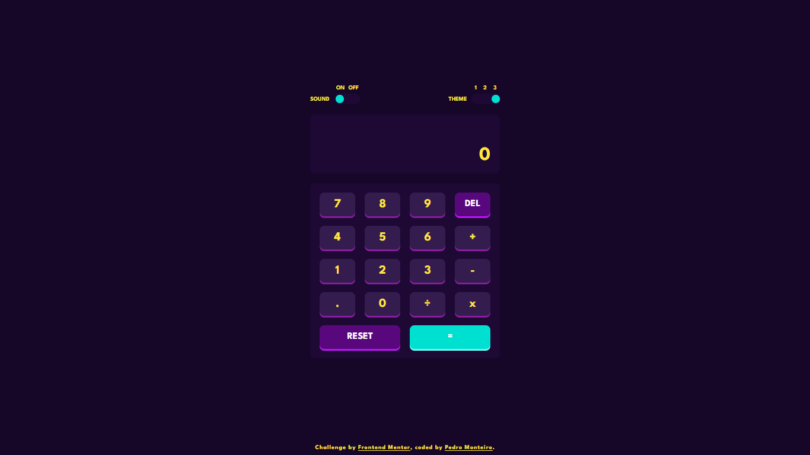

# Frontend Mentor - Calculator app solution

This is a solution to the [Calculator app challenge on Frontend Mentor](https://www.frontendmentor.io/challenges/calculator-app-9lteq5N29). Frontend Mentor challenges help you improve your coding skills by building realistic projects. 

## Table of contents

- [Overview](#overview)
  - [The challenge](#the-challenge)
  - [Screenshots](#screenshots)
  - [Links](#links)
- [My process](#my-process)
  - [Built with](#built-with)
  - [Theme variables and colors](#theme-variables-and-colors)
  - [Useful resources](#useful-resources)
- [Author](#author)

## Overview

### The challenge

Users should be able to:

- See the size of the elements adjust based on their device's screen size
- Perform mathematical operations like addition, subtraction, multiplication, and division
- Adjust the color theme based on their preference
- **Bonus**: Have their initial theme preference checked using `prefers-color-scheme` and have any additional changes saved in the browser

### Screenshots

<p align="center">
  
</p>
<p align="center">
  
</p>
<p align="center">
  
</p>
<!-- <p align="center">
  
  
  
</p> -->

### Links

- Solution URL: [https://github.com/montteiropedro/calculator/](https://github.com/montteiropedro/calculator/)
- Live Site URL: [https://montteiropedro.github.io/calculator/](https://montteiropedro.github.io/calculator/)

## My process

### Built with

- HTML5
- CSS3
- Javascript
- Mobile-first workflow

### Theme variables and colors

**Theme 1**
```css
/* Backgrounds colors */
--main-background: #3a4764;
--toggle-keypad-background: #232c43;
--display-background: #182034;

/* Keys colors */
--key-primary: #eae3dc;
--key-primary-shadow: #b4a597;

--key-secondary: #637097;
--key-secondary-shadow: #404e72;

--key-tertiary: #d03f2f;
--key-tertiary-shadow: #93261a;

/* Text colors */
--text-display: #ffffff;
--text-primary: #444b5a;
--text-secondary: #ffffff;
```

**Theme 2**
```css
/* Backgrounds colors */
--main-background: #e6e6e6;
--toggle-keypad-background: #d1cccc;
--display-background: #ededed;

/* Keys colors */
--key-primary: #e5e4e1;
--key-primary-shadow: #a69d91;

--key-secondary: #377f86;
--key-secondary-shadow: #1b5f65;

--key-tertiary: #ca5502;
--key-tertiary-shadow: #893901;

/* Text colors */
--text-display: #35352c;
--text-primary: #35352c;
--text-secondary: #ffffff;
```

**Theme 3**
```css
/* Backgrounds colors */
--main-background: #160628;
--toggle-keypad-background: #1d0934;
--display-background: #1d0934;

/* Keys colors */
--key-primary: #341c4f;
--key-primary-shadow: #871c9c;

--key-secondary: #58077d;
--key-secondary-shadow: #bc15f4;

--key-tertiary: #00e0d1;
--key-tertiary-shadow: #6cf9f2;

/* Text colors */
--text-display: #ffe53d;
--text-primary: #ffe53d;
--text-secondary: #ffffff;
```

### Useful resources

- [Build A Calculator With JavaScript Tutorial](https://youtu.be/j59qQ7YWLxw) - This helped me to begin the project.
- [Creating a Dark Mode Switcher With CSS and JavaScript](https://youtu.be/Xk12JtYG8rw) - This helped me to have a better understanding of how to use CSS and Javascript to theme my application.

## Author

- Website - [Pedro Monteiro](https://www.linkedin.com/in/montteiropedro/)
- Frontend Mentor - [@montteiropedro](https://www.frontendmentor.io/profile/montteiropedro)
- Twitter - [@montteiropedro](https://www.twitter.com/montteiropedro)
